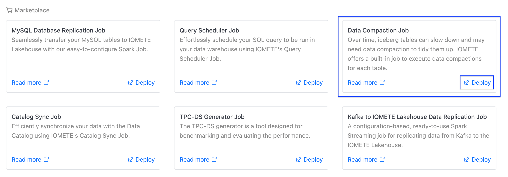
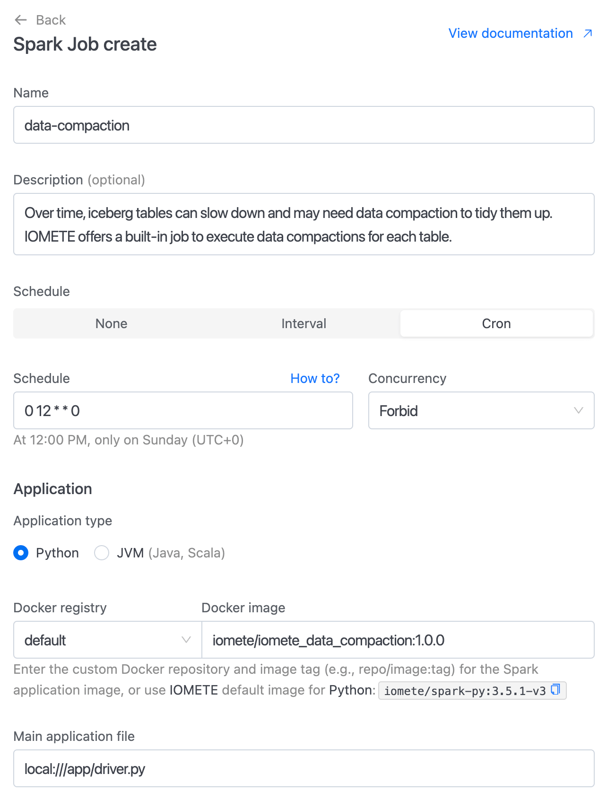
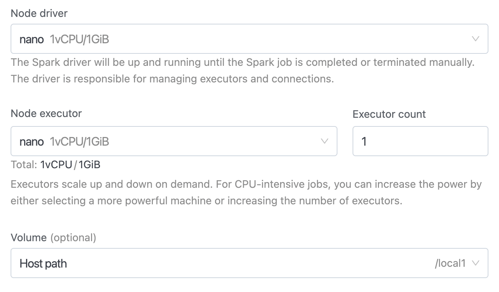
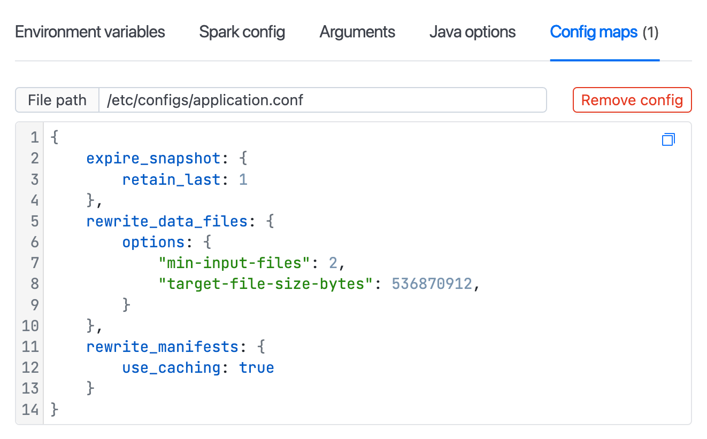

# IOMETE: Spark Job Template

Over the time iceberg tables could slow down and require to run data compaction to clean up tables.  
**IOMETE** provides built-in job to run data compactions for each table. This job triggers the next iceberg processes:

1. ExpireSnapshots [Maintenance - Expire Snapshots](https://iomete.com/resources/reference/iceberg-tables/maintenance#expire-snapshots)
2. Delete Orphan Files - See [Maintenance - Delete Orphan Files](https://iomete.com/resources/reference/iceberg-tables/maintenance#delete-orphan-files)
3. Rewrite Data Files - See [Maintenance - Rewrite Data Files](https://iomete.com/resources/reference/iceberg-tables/maintenance#compact-data-files)
4. Rewrite Manifests - See [Maintenance- Rewrite Manifest Files](https://iomete.com/resources/reference/iceberg-tables/maintenance#rewrite-manifests)

To enable data compaction spark job follow the next steps:

Navigate to the `Job Templates`, then click the `Deploy` button on the **Data Compaction Job** card.

<!-- 1. In the left sidebar menu choose `Spark Jobs`
1. `Create` new job
1. Fill the form with below values:
   - Docker Image: `iomete/iomete_data_compaction:1.0.0`
   - Main application file: `local:///app/driver.py`
   - Main class: _Leave empty_ -->

<kbd></kbd>

<br/>

You will see the job creation page with all inputs filled.

<kbd></kbd>

<br/>

**Instance**

<!-- <kbd></kbd> -->

<kbd></kbd>

<br/>

**Job Configurations**

<!-- <kbd></kbd> -->

<kbd></kbd>

<br/>

## Additional Configurations

You can specify additional configurations

```HOCON
{
    // The catalog for which to run compaction
    catalog: "spark_catalog",
    
    // Batch size for stats collection (DEFAULT: 100)
    // Higher values reduce database writes but use more memory
    // Set to 1 to disable batching (immediate writes)
    stats_batch_size: 100,
    
    // Databases in the catalog for which to run compaction
    // Defaults to empty array
    // In case the input is an empty array then we consider all databases in the provided catalog for compaction 
    databases: [],
    
    // Tables to be included in the compaction run
    // Used as a whitelist. Default to empty array
    // In case the input is an empty array then we consider all tables in the provided database for compaction
    // Supports two formats:
    //   - <database>.<table> - applies to specific table in specific database
    //   - <table> - applies to table in all databases (from 'databases' config or all available databases if config is empty)
    table_include: [],

    // Tables to be excluded in the compaction run
    // Used as a blacklist. Defaults to empty array
    // Ignored if table_include is non empty
    // Supports two formats:
    //   - <database>.<table> - excludes specific table in specific database
    //   - <table> - excludes table from all databases (from 'databases' config or all available databases if config is empty)
    table_exclude: [],
    
    // Configuration for handling tables with G.C. disabled
    // When enabled, the job will check if G.C. is disabled for a table
    // If G.C. is disabled, it will temporarily enable it, run compaction, and then disable it again
    // Defaults to false
    gc_handling: {
        enabled: false
    },
    
    // Default fallback configs for expire_snapshot operation
    expire_snapshot: {
        // Enable/disable this operation (DEFAULT: true)
        // Set to false to skip this operation entirely
        // enabled: true,

        // Number of ancestor snapshots to preserve (DEFAULT: 1)
        // retain_last: 1,

        // Remove snapshots older than the specified number of days (DEFAULT: None)
        // When not specified, only retain_last is used
        // older_than_days: 7
    },
    
    // Default fallback configs for rewrite_data_files operation
    rewrite_data_files: {
        // Enable/disable this operation (DEFAULT: true)
        // Set to false to skip this operation entirely
        // enabled: true,

        // Filter to compact only specific rows (DEFAULT: None - compact all rows)
        // Uses SQL WHERE clause syntax to specify which data to compact
        // where: "date <= CURRENT_DATE - 1",

        options: {
            // The minimum number of files that need to be in a file group for it to be considered for compaction.
            // Defaults to 5
            "min-input-files": 2,

            // The output file size that this rewrite strategy will attempt to generate when rewriting files.
            // Defaults to 512MB (536870912 bytes)
            // "target-file-size-bytes": 536870912,

            // The entire rewrite operation is broken down into pieces based on partitioning and within partitions based on size into groups.
            // These sub-units of the rewrite are referred to as file groups.
            // The largest amount of data that should be compacted in a single group is controlled by MAX_FILE_GROUP_SIZE_BYTES.
            // This helps with breaking down the rewriting of very large partitions which may not be rewritable otherwise due to the resource constraints of the cluster.
            // Defaults to 100GB (1024L * 1024L * 1024L * 100L)
            // "max-file-group-size-bytes": 107374182400
        }
    },
    
    // Default fallback configs for rewrite_manifests operation
    rewrite_manifests: {
        // Enable/disable this operation (DEFAULT: true)
        // Set to false to skip this operation entirely
        // enabled: true,

        // Use Spark caching during operation (defaults to false). Enabling caching can increase memory footprint on executors.
        // Set to false to avoid memory issues on executors
        // use_caching: true
    },
    
    // Default fallback configs for remove_orphan_files operation
    remove_orphan_files: {
        // Enable/disable this operation (DEFAULT: true)
        // Set to false to skip this operation entirely
        // enabled: true,

        // Orphan files older than the provided number of days will be removed
        // Defaults to 1
        older_than_days: 1,
        
        // Maximum number of orphan files to include in a single metrics record
        // When the number of removed files exceeds this threshold, the file list
        // will be split into multiple records to avoid character length limits
        // Defaults to 100
        max_files_per_record: 100
    },

    // Optional: Prevent concurrent compactions on the same table across instances
    // Disabled by default. Uses an Iceberg table property lock with TTL, no heartbeat
    lock: {
        enabled: false,
        // TTL must be >= worst-case compaction duration for a table
        // Default is 172800 seconds (48h) to cover 1-day runs plus buffer
        ttl_seconds: 172800
    },
    
    // Used to override operation configs for specific tables
    // Supports two formats for table keys:
    //   - <database>.<table> - override for specific table in specific database (takes priority)
    //   - <table> - override for table in all databases (from 'databases' config or all available databases if config is empty)
    table_overrides: {
        // Table for which configs needs to be overridden
        <database>.<table>: {
            // Operation whose config you want to override
            <operations>: {
                // Operation level config which needs to be overriden
                <config_name> : ""
            }
        }
    }
}
```

### Concurrency Control via Table Property Lock

- When `lock.enabled=true`, the job attempts to acquire a lock per table by setting the Iceberg table property `iomete.compaction.lock`.
- If the property exists and is not expired, the table is skipped.
- If the property is missing or expired, the job sets the property atomically (via `ALTER TABLE ... SET TBLPROPERTIES`);
- The lock value includes an `ownerId`, a random `nonce`, and an `expiresAt` timestamp; release unsets the property only if ownership matches.

### Troubleshooting Table Locks

**Stuck Locks**: If a job crashes and leaves a lock, it will automatically expire after the configured TTL. To check or manually release a stuck lock:

```sql
-- Check current lock status
SHOW TBLPROPERTIES catalog.database.table_name;

-- Manual lock release (if needed)
ALTER TABLE catalog.database.table_name UNSET TBLPROPERTIES ('iomete.compaction.lock');
```

**Lock Format**: The lock value contains `ownerId=<owner>;nonce=<random>;expiresAt=<timestamp>;version=1` for identification and expiry tracking.

**Common Issues**:
- **Lock acquisition failures**: Usually indicates another instance is actively running compaction on the table
- **Premature lock expiry**: Increase `ttl_seconds` if compaction runs longer than expected
- **Permission errors**: Ensure the job has `ALTER TABLE` privileges on the target tables

## Selective Operation Execution

By default, all four operations (Rewrite Data Files, Rewrite Manifest Files, Expire Snapshots, and Orphan File Removal) are **enabled** and will run during compaction. You can selectively disable specific operations using the `enabled` flag.

### Example: Disable Specific Operations Globally

```HOCON
{
    catalog: "spark_catalog",

    // Run only expire snapshots and remove orphan files
    // Skip rewrite operations
    expire_snapshot: {
        enabled: true,  // This operation will run
        retain_last: 1
    },
    rewrite_data_files: {
        enabled: false  // Skip this operation
    },
    rewrite_manifests: {
        enabled: false  // Skip this operation
    },
    remove_orphan_files: {
        enabled: true,  // This operation will run
        older_than_days: 1
    }
}
```

### Example: Disable Operations for Specific Tables

You can also disable operations for specific tables while keeping them enabled globally:

```HOCON
{
    catalog: "spark_catalog",

    // Global defaults - all operations enabled
    expire_snapshot: {
        enabled: true,
        retain_last: 1
    },
    rewrite_data_files: {
        enabled: true,
        options: {
            "min-input-files": 2
        }
    },

    // Disable specific operations for specific tables
    table_overrides: {
        production.critical_table: {
            // Disable rewrite operations for this critical table
            rewrite_data_files: {
                enabled: false
            },
            rewrite_manifests: {
                enabled: false
            }
        },
        analytics.archive_table: {
            // Only run orphan file removal for archived tables
            expire_snapshot: {
                enabled: false
            },
            rewrite_data_files: {
                enabled: false
            },
            rewrite_manifests: {
                enabled: false
            }
        }
    }
}
```

## Rewrite Data Files with WHERE Filter

Use the `where` parameter to compact only specific rows based on SQL WHERE conditions. Works on both partitioned and non-partitioned tables.

**Performance:** Filtering by partition columns is more efficient as Iceberg can skip files without reading them. Non-partition columns require file scanning.

**Error Handling:** If the WHERE clause references a non-existent column, the compaction will fail for that table and the error will be logged. Other tables will continue processing.

### Examples

```HOCON
{
    catalog: "spark_catalog",

    // Compact recent data (works best with partition column)
    rewrite_data_files: {
        // Static date filter
        where: "date >= '2025-01-01'"

        // Dynamic filters (recommended - no manual date updates needed)
        // where: "date <= CURRENT_DATE - 30"                         // Data older than 30 days
        // where: "date <= CURRENT_DATE - 7"                          // Data older than 7 days
        // where: "date <= add_months(CURRENT_DATE, -6)"              // Data older than 6 months
        // where: "date <= trunc(CURRENT_DATE, 'MM')"                 // Data before current month
        // where: "event_time <= CURRENT_TIMESTAMP - INTERVAL 1 DAY"  // Data older than 1 day
    }

    // Table-specific filters
    table_overrides: {
        analytics.events: {
            rewrite_data_files: {
                where: "event_date <= CURRENT_DATE - 14"
            }
        }
    }
}
```

## Expire Snapshots Configuration

The `expire_snapshot` operation uses two parameters to control snapshot retention:
- `retain_last`: Keep the N most recent snapshots (default: 1)
- `older_than_days`: Remove snapshots older than N days

### Retention Rules

| Configuration | Behavior |
|---------------|----------|
| **None specified** | Keeps 1 snapshot (default) |
| **Only `retain_last`** | Keeps the last N snapshots |
| **Only `older_than_days`** | Removes snapshots older than N days (minimum 1 snapshot always kept) |
| **Both specified** | Keeps snapshots matching EITHER condition (maximum retention) |

### Examples

```HOCON
{
    catalog: "spark_catalog",

    // Keep last 5 snapshots
    expire_snapshot: {
        retain_last: 5
    }

    // Remove snapshots older than 7 days (but keep at least 1)
    expire_snapshot: {
        older_than_days: 7
    }

    // Keep last 3 snapshots OR snapshots newer than 7 days (whichever is more)
    expire_snapshot: {
        retain_last: 3,
        older_than_days: 7
    }

    // Table-specific settings
    table_overrides: {
        production.critical_table: {
            expire_snapshot: {
                retain_last: 10,
                older_than_days: 30
            }
        }
    }
}
```

## Using project in local/dev environment

```shell
python3.12 -m venv .env
source .env/bin/activate

pip install -e ."[dev]"
```

```shell
pytest
```
