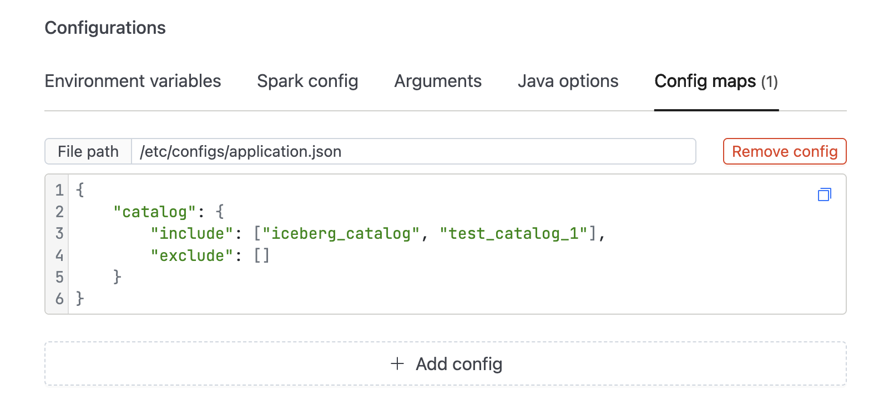

## Spark Deployment
References:
- https://spark.apache.org/docs/latest/submitting-applications.html

## Quickstart

```bash
# 1, Build code
../gradlew clean quarkusBuild

# 2. Update docker tag version in Makefile
# 3. Build image and push
make docker-push
```

### Submit spark

It uses spark docker file. To submit spark app to locally downloaded spark see the next section

```shell
make submit
```

### Local spark env

If you want to use spark locally instead of docker follow the steps. 

First we need to do port forward the following services:
- Data catalog service: http://localhost:8084
- Presidio: http://localhost:5001
- Metastore service: localhost:9083

1. Download spark
```shell
make download-spark
```
2. Submit the app to local spark
```shell
make submit-local
```

## Collect table statistics
https://spark.apache.org/docs/3.0.0-preview/sql-ref-syntax-aux-analyze-table.html

## Data catalog resources
https://docs.delta.io/0.8.0/delta-utility.html
https://www.elixirdata.com/blog/data-catalog-architecture
https://www.dataplatformschool.com/blog/intro-to-databricks-governance/
https://marquezproject.github.io/marquez/


## Prod deployment

Deploy the following config
```json
{
  "name": "lakehouse-metadata-sync1",
  "config": {
    "image": "680330367469.dkr.ecr.eu-central-1.amazonaws.com/iomete/lakehouse-metadata-sync:master-a340926-2021-07-16",
    "main_application_file": "local:///opt/spark/jars/lakehouse-metadata-sync-2.0.0-runner.jar",
		"main_class": "com.iomete.LakehouseMetadataSyncMain",
    "spark_version": "3.1.1",
    "driver": {
      "env_vars": {
        "PRESIDIO_MP_REST_URL": "http://presidio-analyzer-presidio-analyzer.shared-services:80",
        "DATA_CATALOG_SERVICE": "http://data-catalog-staging.iomete-services",
		"APPLICATION_INCLUDE_SCHEMAS": "default"
      }
    }
  }
}
```

## Custom log4j.properties location

You need to add the following java system variables to driver and executors:
```shell
-Dlog4j.configuration=file:///location-to/log4j.properties

#example (Jobs UI)
Java options: -Dlog4j.configuration=file:///etc/iomete/conf/log4j.properties
```


## Job Configurations

You can provide additional job-specific configurations using ConfigMaps.
* Configuration File Path:
```
/etc/configs/application.json
```
* Sample Configuration (`application.json`):
```json
{
    "catalog": {
        // Catalogs to include in the catalog-sync run
        // Acts as a whitelist. Defaults to an empty array.
        // If left empty, all catalogs are included.
        "include": [],
        // Catalogs to exclude from the catalog-sync run
        // Acts as a blacklist. Defaults to an empty array.
        // Ignored if 'include' is non-empty.
        "exclude": []
    }
}
```
* Reference Example:
<!-- <kbd></kbd> -->

<kbd></kbd>

<br/>