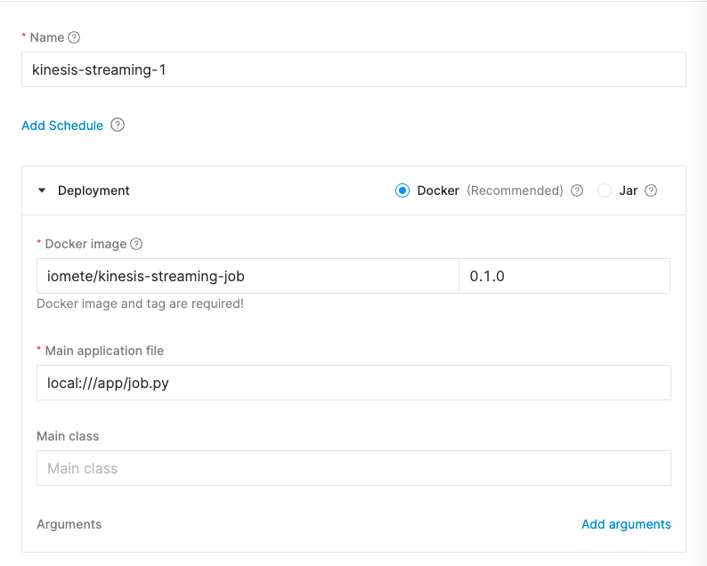
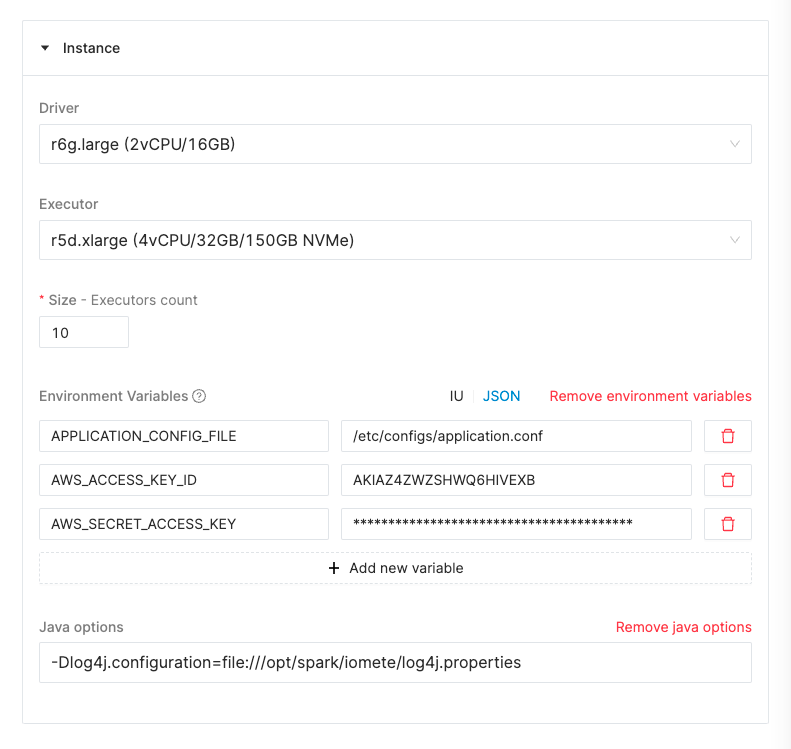
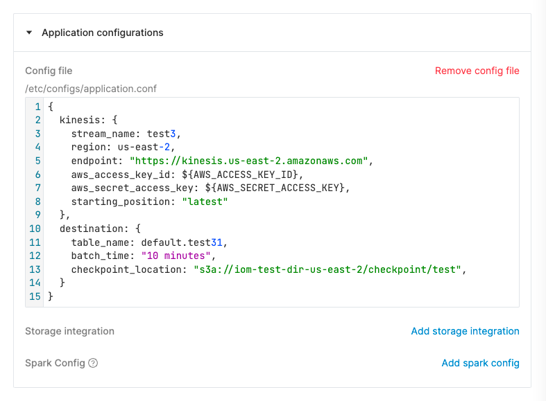

# IOMETE: Kinesis Streaming Job

This project contains a spark streaming job that reads data from a kinesis stream and writes it to a Iceberg Table.

> Note: For kinesis streaming this library is used: https://github.com/roncemer/spark-sql-kinesis

## Project Anatomy

The project is composed of the following folders/files:

- `infra/`: contains requirements and Dockerfile files
    - `requirements-dev.txt`: contains the list of python packages to install for development
    - `requirements.txt`: contains the list of python packages to install for production. This requirements file is used
      to build the Docker image
    - `Dockerfile`: contains the Dockerfile to build the spark job image
- `spark-conf/`: contains the spark configuration files for development environment
    - `spark-defaults.conf`: contains the spark configuration
    - `log4j.properties`: contains the log4j configuration for local logging
- `job.py`: contains the spark job code

## Development

### Install dependencies

```bash
virtualenv .env #or python3 -m venv .env
source .env/bin/activate

make install-dev-requirements
```

### Run job

> Note: The AWS credentials must be set in the environment variables. Please, export the following environment
> variables:
> AWS_ACCESS_KEY_ID, AWS_SECRET_ACCESS_KEY

```bash
make run-job
```

## Deployment

Configure the following parameters

### Application details

| Parameter             | Value                                | Description                                                                                                                                                                          |
|-----------------------|--------------------------------------|--------------------------------------------------------------------------------------------------------------------------------------------------------------------------------------|
| Name                  | User provided name                   | Name of the application                                                                                                                                                              |
| Docker image          | `iomete/kinesis-streaming-job:0.1.0` | Docker image to use for the application. Check [here](https://hub.docker.com/repository/docker/iomete/kinesis-streaming-job/tags?page=1&ordering=last_updated) for the latest images |
| Main application file | `local:///app/job.py`                | Main application file to run. This file is located in the Docker image                                                                                                               |



### Environment variables

| Env Var                 | Value                           | Description                                                                                                                               |
|-------------------------|---------------------------------|-------------------------------------------------------------------------------------------------------------------------------------------|
| APPLICATION_CONFIG_FILE | `/etc/configs/application.conf` | This where the application configuration will be mounted. This environment variable is read by the job to get the application file's path |
| AWS_ACCESS_KEY_ID       | User provided value             | AWS access key id for Kinesis read                                                                                                        |
| AWS_SECRET_ACCESS_KEY   | User provided value             | AWS secret access key for Kinesis read.                                                                                                   |

Java options: `-Dlog4j.configuration=file:///opt/spark/iomete/log4j.properties`



### Application configuration

This is the main application configuration file. The format
is [hocon file format](https://github.com/lightbend/config/blob/main/HOCON.md). Example configuration file:

```hocon
{
  kinesis: {
    stream_name: kinesis_stream1,                         # name of the kinesis stream
    region: us-east-1,                                    # region of the kinesis stream
    aws_access_key_id: ${AWS_ACCESS_KEY_ID},              # reading from environment variable
    aws_secret_access_key: ${AWS_SECRET_ACCESS_KEY},      # reading from environment variable
    starting_position: "latest"
  },
  destination: {
    table_name: default.tbl,                              # name of the iceberg table to write to. This table is automatically created if it does not exist
    batch_time: "10 minutes",                             # batch time for the streaming job
    checkpoint_location: "s3a://bucket/checkpoint/loc",   # checkpoint location for the streaming job. This is used to recover from failures
  }
}
```




