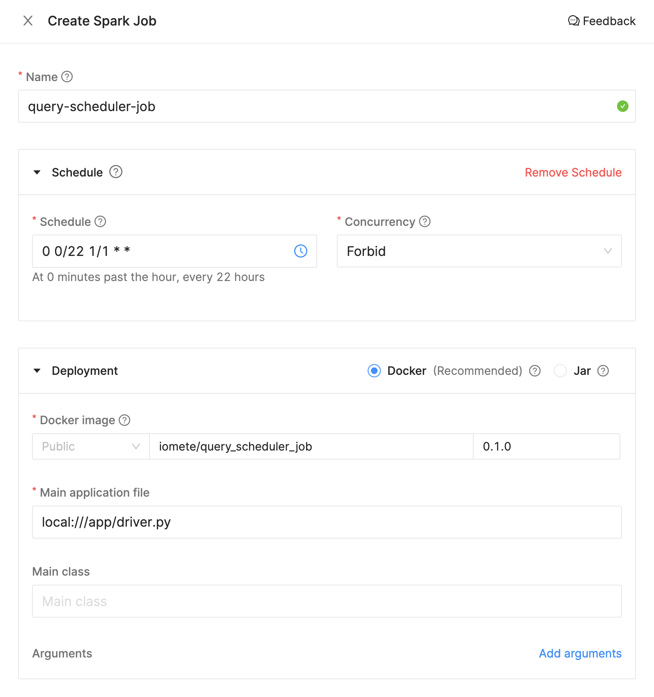
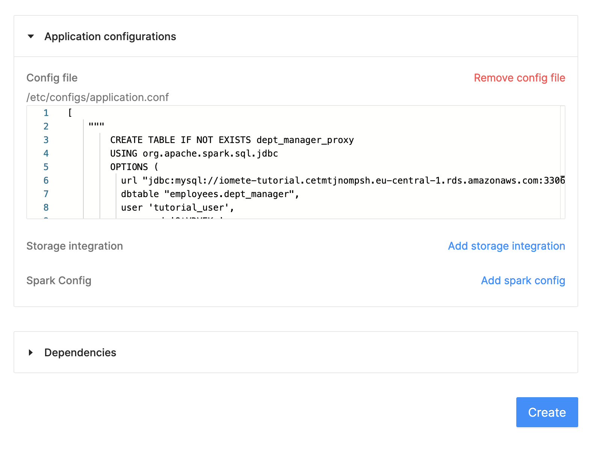
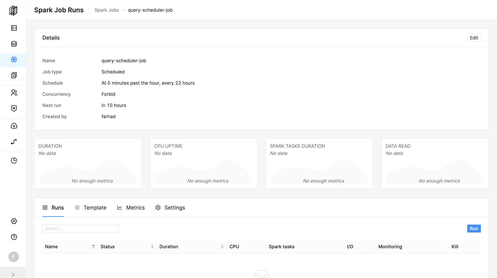

# iomete: Pyspark query scheduler job


## Deployment

- Go to `Spark Jobs`.
- Click on `Create New`.

Specify the following parameters (these are examples, you can change them based on your preference):
- **Name:** `query-scheduler-job`
- **Schedule:** `0 0/22 1/1 * *`
- **Docker Image:** `iomete/query_scheduler_job:0.1.3`
- **Main application file:** `local:///app/driver.py`
- **Config file:** 
```hocon
[
    """
        CREATE TABLE IF NOT EXISTS dept_manager_proxy
        USING org.apache.spark.sql.jdbc
        OPTIONS (
          url "jdbc:mysql://iomete-tutorial.cetmtjnompsh.eu-central-1.rds.amazonaws.com:3306/employees",
          dbtable "employees.dept_manager",
          user 'tutorial_user',
          password '9tVDVEKp'
        );
    """,
    """
        CREATE TABLE IF NOT EXISTS dept_manager AS SELECT  * FROM dept_manager_proxy;
    """
]
```

Create Spark Job


Create Spark Job - Application Config


And, hit the create button.

---
The job will be run based on the defined schedule. But, you can trigger the job manually by clicking on the `Run` button.




## Development

**Prepare the dev environment**

```shell
virtualenv .env #or python3 -m venv .env
source .env/bin/activate

pip install -e ."[dev]"
```

**Run test**

```shell
pytest
```
