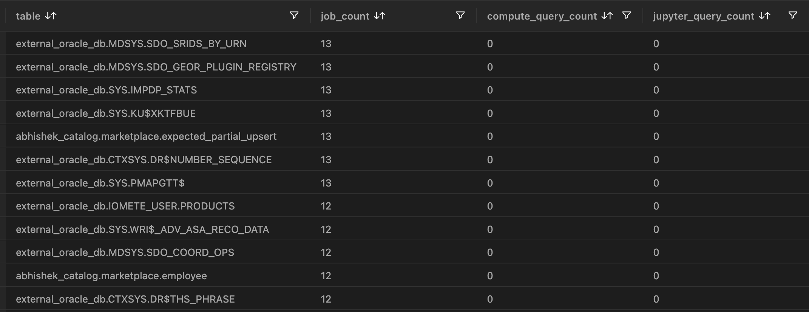
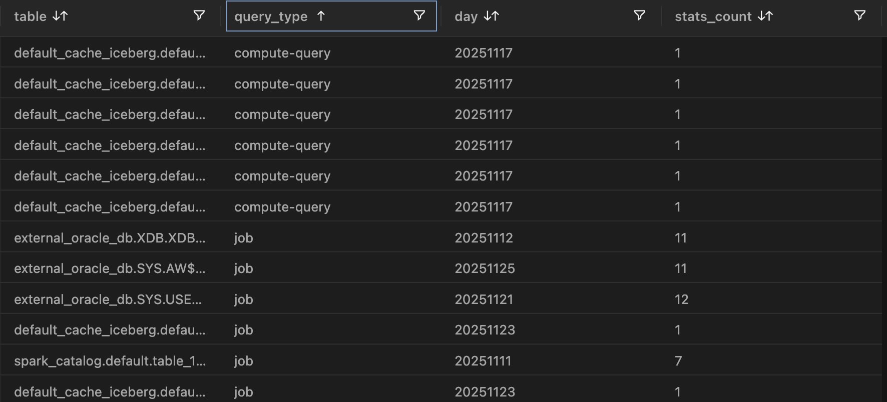

# Useful SQL Tools
This repo contains various SQL queries that can enhance your database management and querying experience.

## Usage Statistics of Tables

### Spark Audit Logs Analysis

We first create external table in spark_catalog for the audit files. See `useful-sql-tools/create_spark_audit_table`.

From this table, one can query

- run time (using eventTime column)
- run date (using day column)
- user (using user column)
- job/query id (using eventId)

### Daily Job Counts

For Daily counts - create a view for a particular day of interest (day has to be hardcoded, such as  '20251125', for example). This is the fast solution as it filter ORC files for a single day. See `useful-sql-tools/create_spark_audit_access_summary_view.sql`. This will create table stats for that day like below:

One can query multiple days. This query can last for some time depending on how much data accumulated on each day, and how many days is being queried. See 11 `useful-sql-tools/create_spark_audit_access_summary_multiple_days_view.sql`. This will create table stats for multiple days like below:

## Track DDL Changes

`useful-sql-tools/track_ddl_changes.sql` tracks changes to IOMETE Iceberg database object definitions, including CREATE TABLE, CREATE VIEW, ALTER TABLE, ALTER VIEW, DROP TABLE, and DROP VIEW operations. Changes are organized by Catalog and Database, and each change is recorded with a timestamp indicating when it occurred. This information could be used to support auditing, traceability, and other program activities.

